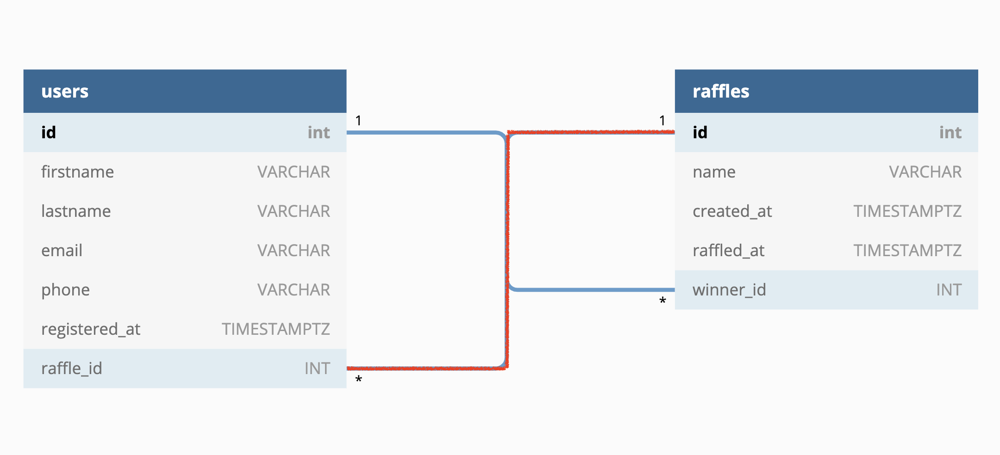

[](https://pursuit.org)

# Web-Backend-Takehome-Coding-Challenge

Back-End coding challenge involving a Node.js & Express.js server and a PostgresSQL database.

## Prerequisites

- A [Repl.it](https://replit.com/) Account
- An [ElephantSQL](https://www.elephantsql.com/) Account for your PostgresSQL Database.
  - You can sign up with a Google or GitHub Account
- [Postman](https://www.postman.com/product/rest-client/) installed to test out your endpoints.

## Getting Started

1. In Repl.it create a blank Node.js App. This will be for your back-end server.
   - You can see an example Node.js/Express.js server in Repl.it [here](https://replit.com/@Vandesm14/Express-Template)
2. Create a Postgres Database in ElephantSQL.
   - Read [How to create a Postgres Database in ElephantSQL.com](./how-to-create-a-postgres-db-in-elephansql.md)
3. Setup your database tables according to the Technical requirements below.
4. Complete your back-end server according to the Technical requirements below.

## Technical Requirements

Your job is to create a back-end server and database for a Raffle application. Users are able to:

- Create raffles
- List all raffles
- Add participants users to raffles
- Draw a winner from a raffle

### Database

You should have at least two database tables to store the information for this app. The diagram below shows tables `users` and `raffles` and their relationships.



### Server

Create an express server with the following endpoints.

#### Endpoints

##### GET `/raffles`

Retrieve all raffles.

##### POST `/raffles`

Post a new raffle. The JSON body to send in the request should include a `name` and `secret_token` property.

Example body: 

```json
{ 
  "name": "My first Raffle", 
  "secret_token": "s3CrE7" 
}
```

##### GET `/raffles/:id`

Retrieve a single raffle by its id.

##### GET `/raffles/:id/participants`

Retrieve all user participants of a raffle.

##### POST `/raffles/:id/participants`

Sign up a participant to a raffle given a raffle id. The JSON body to send must include `firstname`, `lastname`, and `email`.
`phone` is optional

`email` should be unique to protect from the same user signing multiple times for the same raffle.

Example body: 

```json
{ 
  "firstname": "Jane",
  "lastname": "Doe",
  "email": "jdoe@email.com",
  "phone": "+1 (917) 555-1234",
}
```

##### PUT `/raffles/:id/winner`

Perform the raffle and select the winner at random picking from the users that are signed up for the raffles specified by id. The raffle will only be performed if the request body includes a secret token that matches the token used the raffle was created via POST `/raffles`.

If the token is not present or doesn't match return an error message.

Request body:

```json
{ "secret_token" : "s3CrE7" }
```

If drawing a winner is successful return the winner participant.

Response body:

```json
{
    "id": 2,
    "raffle_id": 1,
    "firstname": "John",
    "lastname": "Snow",
    "email": "jblizzard@email.com",
    "phone": null,
    "registered_at": "2021-05-22T15:43:52.647Z"
}
```

**Note:** If a winner is attempted to be picked multiple times don't allow it and return the existing winner instead. Multiple identical PUT request should have the same result, this is the definition of [idempotence](https://developer.mozilla.org/en-US/docs/Web/HTTP/Methods/PUT#:~:text=The%20difference%20between%20PUT%20and,placing%20an%20order%20several%20times.).

#### Bonus Endpoints

##### GET `/raffles/:id/winner`

Retrieve the winner of a raffle. This endpoint does **not** need a request with a JSON body.

##### GET `/raffles/:id?active=<false|true>`

Using a query param `active`, return raffles that are "active" (`active=true`), meaning they don't have a winner yet or raffles that already have a winner (`active=false`)

## Submission Guidelines

- You should take no more than 5 hours on this challenge.
- Submit the link to your back-end server code in Repl.it using the [submission form](https://docs.google.com/forms/d/e/1FAIpQLSeY0nBqtXTV06b2CmAreHLJzVHlG0cQHUx9g1RKPYer0hNVVQ/viewform?usp=sf_link)
- For any questions reach out to @Alejo in the [Pursuit Core Workspace](https://pursuit-core.slack.com/)

## Resources

- [Repl.it NodeJs Express Basics Tutorial](https://replit.com/talk/learn/NodeJs-Express-tutorial/23519)
